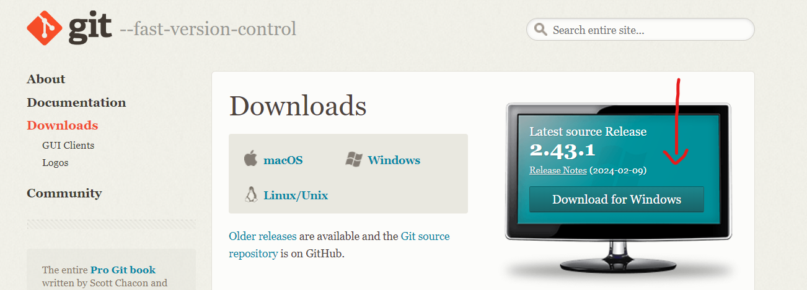

# 🚀 Desarrollo de Aplicaciones Móviles en el Sector Aeroespacial 📱🛰️
Para este taller es necesario que tengas instaladas las siguientes herramientas:
1. [Visual Studio Code (VSC)](https://code.visualstudio.com/)  
2. [Google Chrome](https://www.google.com/intl/es_es/chrome/)
3. [Git](https://git-scm.com/) y [GitHub](https://github.com/)
4. [Node.js](https://nodejs.org/en)
5. [Angular](https://angular.io/)  
6. [Ionic](https://ionicframework.com/)

Sabemos que son muchas herramientas, pero tranquilo aquí te ayudamos a instalarlos:

1. Para instalar VSC solo descárgalo desde su página oficial y sigue la intalación recomendada:

    
    En caso de que se te complique o no te sientas 100% seguro de su intalación te dejamos un [video tutorial](https://www.youtube.com/watch?v=X_Z7d04x9-E).
2. Para instalar [Google Chrome](https://www.google.com/intl/es_es/chrome/) solo descárgalo desde su página oficial.
3. En la instalación de [git](https://git-scm.com/downloads) lo puedes hacer desde la página oficial y seguir la instalación recomendada o puedes ver este [video](https://www.youtube.com/watch?v=WcYTcttEf50).

    
    Para tener cuenta de [GitHub](https://github.com/) lo puedes hacer en su página, es como abrir una red social, pero sabemos que las cosas nuevas aveces dan miedo, por eso te dejamos un [tutorial](https://www.youtube.com/watch?v=dGIsU9F4yW0) para que tengas más confianza al hacerlo, no es necesario crear un repositorio.

    
    
4. En la instalación de [Node.js](https://nodejs.org/en) te recomendamos seguir la instalacion recomendada y reiniciar tu ordenador después de la instalación. Al igual aquí tienes un [video de referencia](https://www.youtube.com/watch?v=dsvCofDdTVA).

    

5. Angular se instala desde terminal, la cual puede ser la bash de git que previamente hemos instalado:

    

    O podemos abrir VSC y abrir una terminal:

    
    Despues solo es necesario colocar el siguiente comando:
        ```sh
        $ npm install -g @angular/cli
        ```
        Aquí tienes un [video de apoyo](https://www.youtube.com/watch?v=UpJSgXCEqGQ)
6. Ionic se instala igual desde terminal de la misma manera que mencionamos para angular pero corriendo el siguiente comando:

    ```sh
    $ npm install -g @ionic/cli
    ```
    Aquí tienes un [video de apoyo](https://www.youtube.com/watch?v=JL8K9HeTmVE).

### Esperamos que disfrutes mucho nuestro curso. ❤️
